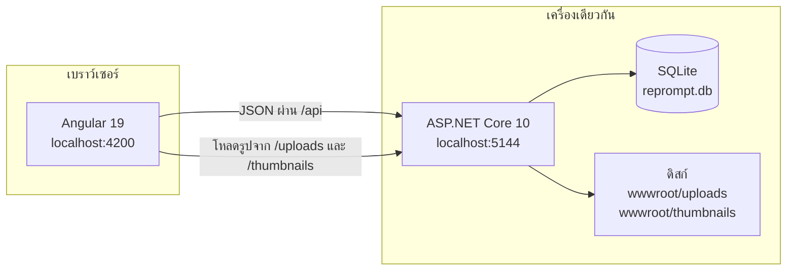
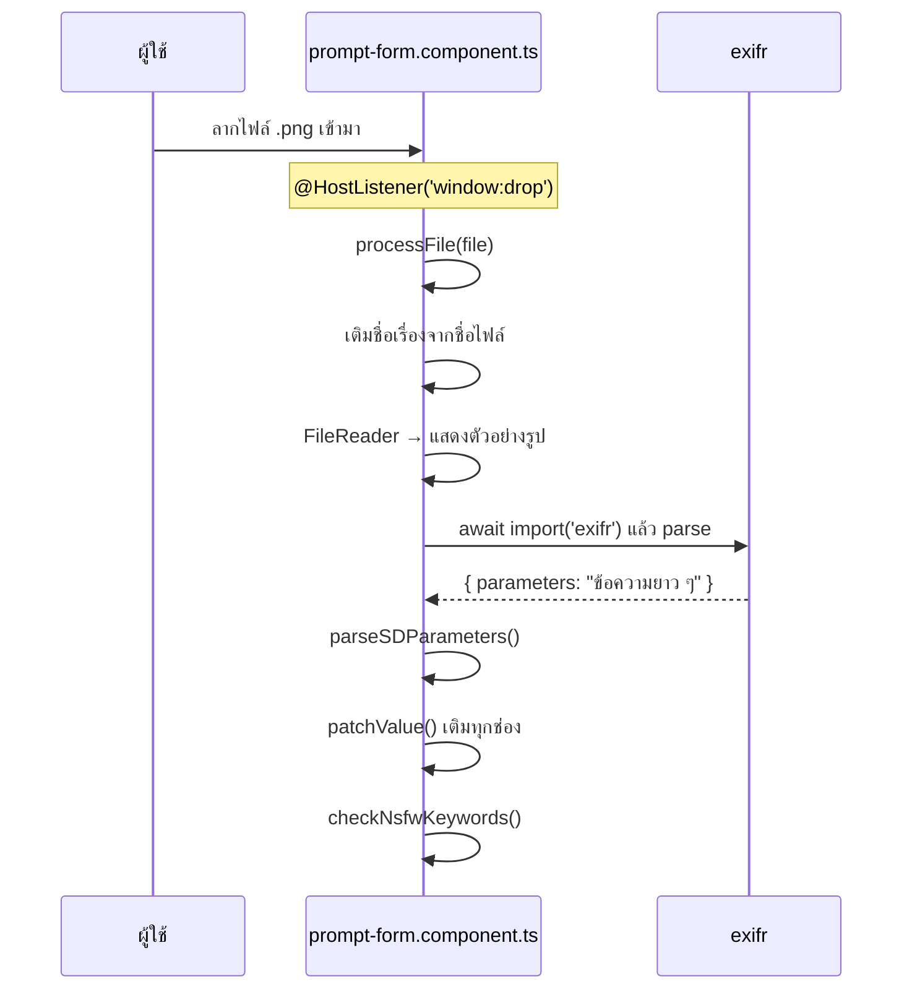
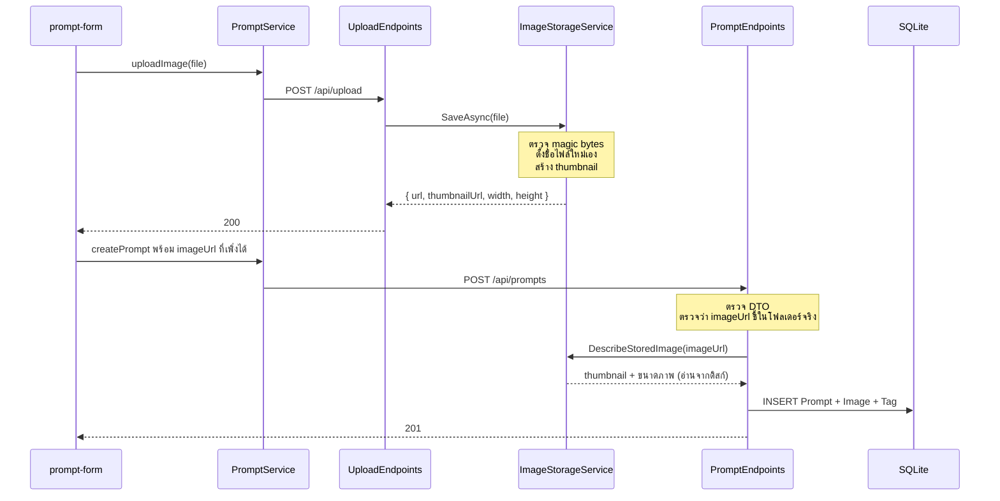
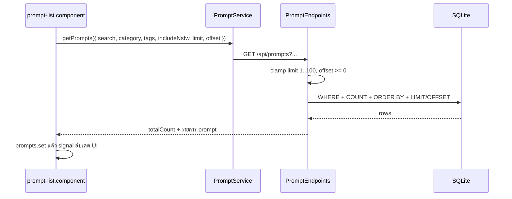
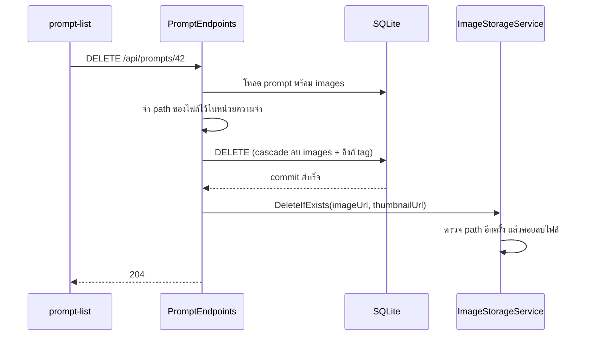
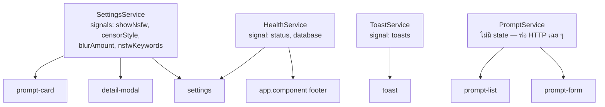
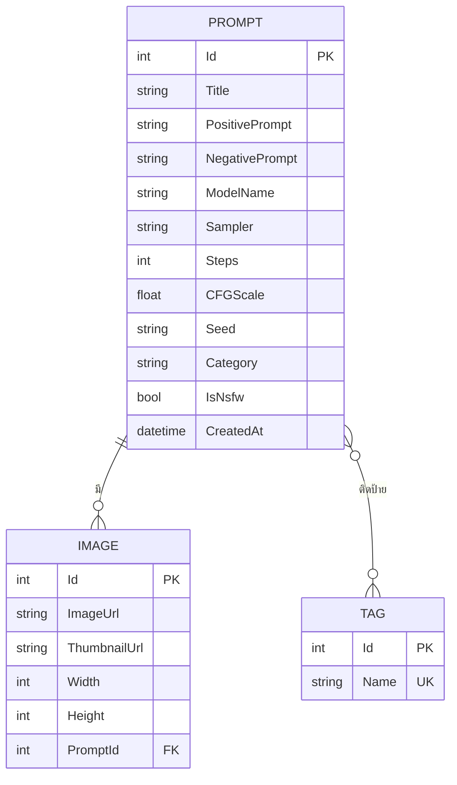

# สถาปัตยกรรมและการทำงานของ RePrompt

เอกสารนี้อธิบายว่าระบบทำงานอย่างไร — ข้อมูลเดินทางจากไหนไปไหน ไฟล์ไหนรับผิดชอบอะไร
และ **ทำไมถึงเลือกทำแบบนั้น**

[README](README.md) ตอบว่าโปรเจกต์นี้คืออะไร ส่วนไฟล์นี้ตอบว่ามันทำงานยังไง

---

## สารบัญ

- [ภาพรวม](#ภาพรวม)
- [Flow 1 — ลากรูปเข้ามาแล้วบันทึก](#flow-1--ลากรูปเข้ามาแล้วบันทึก) ← flow ที่ซับซ้อนที่สุด
- [Flow 2 — เปิดหน้าแกลเลอรีและกรอง](#flow-2--เปิดหน้าแกลเลอรีและกรอง)
- [Flow 3 — ลบข้อมูล](#flow-3--ลบข้อมูล)
- [ชั้นต่าง ๆ ฝั่ง backend](#ชั้นต่าง-ๆ-ฝั่ง-backend)
- [การจัดการ state ฝั่ง frontend](#การจัดการ-state-ฝั่ง-frontend)
- [ฐานข้อมูล](#ฐานข้อมูล)
- [การตัดสินใจเชิงออกแบบ](#การตัดสินใจเชิงออกแบบ)
- [บทเรียนจากบั๊กที่เจอ](#บทเรียนจากบั๊กที่เจอ)

---

## ภาพรวม

ระบบมี 3 ส่วนที่แยกจากกันชัดเจน และคุยกันผ่าน HTTP อย่างเดียว



จุดที่มักถูกเข้าใจผิด: **รูปภาพไม่ได้เก็บในฐานข้อมูล** ฐานข้อมูลเก็บแค่ *ที่อยู่* ของไฟล์
(`/uploads/abc123.png`) ส่วนตัวไฟล์อยู่บนดิสก์ ทำให้ backup ต้องเอาทั้งสองอย่าง
และเป็นเหตุผลที่ต้องมีโค้ดคอยจัดการไม่ให้ทั้งสองฝั่งหลุดจากกัน

---

## Flow 1 — ลากรูปเข้ามาแล้วบันทึก

นี่คือฟีเจอร์หลักของระบบและเป็น flow ที่มีรายละเอียดมากที่สุด

### ขั้นที่ 1 — อ่าน metadata ในเบราว์เซอร์ (ยังไม่แตะเซิร์ฟเวอร์เลย)



**ไฟล์:** [`prompt-form.component.ts`](frontend/src/app/features/prompt-form/prompt-form.component.ts)

Automatic1111 ฝังการตั้งค่าไว้ใน **PNG `tEXt` chunk** คีย์ชื่อ `parameters` ส่วนเครื่องมืออื่น
ใส่ไว้ใน **EXIF `UserComment`** ของ JPEG โค้ดจึงอ่านทั้งสองที่:

```ts
const rawParams = metadata?.parameters || metadata?.UserComment;
```

`exifr` คืนมาเป็น **ก้อนข้อความเดียว** หน้าตาแบบนี้:

```
masterpiece, neon city street at night
Negative prompt: blurry, lowres
Steps: 28, Sampler: DPM++ 2M Karras, CFG scale: 7.5, Seed: 3942611316, Model: sd_xl_base_1.0
```

การแยกเป็นแต่ละช่องคือ `parseSDParameters()` ที่เขียนเอง ไม่ใช่ของ library — ตัดที่คำว่า
`Negative prompt:` และ `Steps:` แล้วใช้ regex ดึงค่าที่เหลือ

> **ทำไมอ่านฝั่งเบราว์เซอร์:** ผู้ใช้เห็นผลทันทีตั้งแต่ยังไม่กดบันทึก ถ้าดึงมาผิดก็แก้ก่อนได้
> และเซิร์ฟเวอร์ไม่ต้องแบกงาน parse

### ขั้นที่ 2 — กดบันทึก: อัปโหลดก่อน แล้วค่อยบันทึก



**ไฟล์ที่เกี่ยวข้อง**

| ไฟล์ | ทำอะไร |
| --- | --- |
| [`prompt.service.ts`](frontend/src/app/core/services/prompt.service.ts) | ห่อ HttpClient ทุก endpoint รวมอยู่ที่นี่ที่เดียว |
| [`UploadEndpoints.cs`](backend/RePrompt.Api/Endpoints/UploadEndpoints.cs) | รับไฟล์ ส่งต่อให้ service |
| [`ImageStorageService.cs`](backend/RePrompt.Api/Services/ImageStorageService.cs) | **ทุกอย่างที่แตะดิสก์อยู่ในคลาสนี้คลาสเดียว** |
| [`PromptRequest.cs`](backend/RePrompt.Api/Dtos/PromptRequest.cs) | รูปแบบข้อมูลขาเข้า แยกจาก entity |
| [`PromptEndpoints.cs`](backend/RePrompt.Api/Endpoints/PromptEndpoints.cs) | ตรวจข้อมูล แปลงเป็น entity บันทึก |

**สิ่งที่ `SaveAsync` ทำกับไฟล์ที่รับมา**

1. เช็คขนาด ไม่เกิน 50 MB
2. อ่าน 12 ไบต์แรกแล้วดูว่า **เป็นรูปจริงไหม** — ไม่เชื่อ `Content-Type` ที่ client ส่งมา เพราะปลอมได้
3. ตั้งชื่อไฟล์ใหม่เป็น `{GUID}{นามสกุลที่ได้จากไบต์จริง}` — **ชื่อไฟล์เดิมจากผู้ใช้ไม่เคยไปถึงดิสก์**
4. ย่อรูปเป็น WebP ด้วย SkiaSharp เก็บไว้ที่ `wwwroot/thumbnails/`

> **ทำไมไม่เชื่อ `Content-Type`:** ถ้าเชื่อ ผู้ใช้ส่งไฟล์ `.html` แล้วบอกว่าเป็น `image/png` ได้
> ไฟล์นั้นจะถูกเก็บและ **เสิร์ฟกลับมาจาก origin เดียวกับ API** กลายเป็น stored XSS
> การอ่านไบต์จริงกับตั้งชื่อไฟล์เองปิดช่องนี้ทั้งสองทาง

**จุดที่ควรสังเกต:** ตอนบันทึก prompt ฝั่งเซิร์ฟเวอร์ **ไม่รับ** `thumbnailUrl` กับขนาดภาพจาก client
แต่ไปอ่านจากดิสก์ใหม่เองผ่าน `DescribeStoredImage()` — client โกหกเรื่องเหล่านี้ไม่ได้

### ขั้นที่ 3 — ถ้าบันทึกไม่สำเร็จ

อัปโหลดสำเร็จแล้วแต่บันทึกพัง จะเหลือไฟล์ค้างบนดิสก์ที่ไม่มีใครอ้างถึง ฟอร์มจึงเรียก
`discardUpload()` เพื่อลบทิ้ง และ endpoint นั้น**ปฏิเสธการลบไฟล์ที่มี prompt อ้างถึงอยู่** (ตอบ 409)
เพื่อไม่ให้กลายเป็นช่องทางลบรูปของคนอื่น

---

## Flow 2 — เปิดหน้าแกลเลอรีและกรอง



**การกรองทั้งหมดทำฝั่งเซิร์ฟเวอร์** รวมถึงการซ่อน NSFW ในโหมด strict

> **ทำไมถึงสำคัญ:** ตอนแรกโหมด strict กรองในเบราว์เซอร์ด้วย `*ngIf` แต่ `totalCount` มาจากเซิร์ฟเวอร์
> ตัวเลข "แสดง x / y" เลยนับรวมของที่ผู้ใช้มองไม่เห็น และ infinite scroll ก็เจอหน้าว่าง
> พอย้ายมากรองที่ SQL ทั้งสองอาการหายไปพร้อมกัน — **ตัวเลขกับสิ่งที่เห็นต้องมาจากที่เดียวกัน**

**การแบ่งหน้า** ใช้ `offset = จำนวนที่โหลดมาแล้ว` ไม่ได้เก็บตัวนับแยก เพราะถ้าเก็บแยกแล้วผู้ใช้ลบไป 1 รายการ
หน้าถัดไปจะข้ามข้อมูลไป 1 ตัว

**การกรองหลายแท็ก** ใช้เงื่อนไข AND — ยิ่งใส่แท็กยิ่งแคบลง สร้างจากการวน `Where()` ทีละแท็ก:

```csharp
foreach (var tag in ParseTagNames(tags))
{
    var required = tag;
    query = query.Where(p => p.Tags.Any(t => t.Name == required));
}
```

### รูปในแกลเลอรีมาจากไหน

การ์ดแต่ละใบใช้ **thumbnail** ไม่ใช่ไฟล์เต็ม และใส่ `width`/`height` ที่เก็บไว้ตอนอัปโหลด
ลงบน `` เพื่อให้เบราว์เซอร์กันที่ไว้ก่อน — คอลัมน์ masonry จะได้ไม่กระโดดตอนรูปทยอยโหลด

รูปเก่าที่ยังไม่มี thumbnail จะ fallback ไปใช้ไฟล์เต็ม และมี
[`ThumbnailBackfillService`](backend/RePrompt.Api/Services/ThumbnailBackfillService.cs)
ทยอยสร้างให้ในเบื้องหลังตอนเปิดเซิร์ฟเวอร์

---

## Flow 3 — ลบข้อมูล

flow สั้นแต่มีลำดับที่ตั้งใจ



> **ทำไมลบ DB ก่อนแล้วค่อยลบไฟล์:** ถ้าลบไฟล์ก่อนแล้ว DB commit ไม่ผ่าน จะเหลือ record ที่ชี้ไปยัง
> ไฟล์ที่หายไปแล้ว — แกลเลอรีขึ้นรูปแตก กู้ไม่ได้
> กลับกัน ถ้า DB สำเร็จแล้วลบไฟล์พลาด จะเหลือแค่ไฟล์ขยะที่ไม่มีใครอ้างถึง ซึ่งกวาดทีหลังได้
> **เลือกความผิดพลาดที่กู้คืนได้**

---

## ชั้นต่าง ๆ ฝั่ง backend

```
Program.cs                    ประกอบทุกอย่างเข้าด้วยกัน ไม่มี business logic
  └─ Endpoints/               รับ request, ตรวจข้อมูล, ตอบกลับ
       └─ Services/           งานที่แตะดิสก์
       └─ Data/AppDbContext   งานที่แตะฐานข้อมูล
            └─ Models/        entity
  Dtos/                       รูปแบบข้อมูลขาเข้า (แยกจาก entity โดยตั้งใจ)
  Validation/                 ตัวช่วยรัน DataAnnotations
```

### ลำดับใน pipeline มีความหมาย

```csharp
app.UseExceptionHandler(...);   // ดักทุก error ที่หลุดมา
app.UseStatusCodePages();
app.UseCors("AllowAngular");    // ต้องมาก่อนสิ่งที่มันคุ้มครอง
app.UseStaticFiles(uploads);    // เสิร์ฟเฉพาะ 2 โฟลเดอร์นี้
app.UseStaticFiles(thumbnails);
api.MapHealthEndpoints();       // ...แล้วค่อยถึง endpoint
```

`UseStaticFiles()` เปล่า ๆ จะเสิร์ฟ `wwwroot` **ทั้งหมด** จึงระบุ `FileProvider` เจาะจงเฉพาะสองโฟลเดอร์
จำกัดนามสกุลที่ยอมเสิร์ฟ และใส่ `X-Content-Type-Options: nosniff` กับ CSP sandbox

### ทำไม DTO ถึงแยกจาก entity

ถ้า endpoint รับ entity ตรง ๆ client จะยัดอะไรเข้ามาก็ได้ที่ entity มี — รวมถึง `Id`, `CreatedAt`
และ image graph ทั้งก้อน (เรียกว่า **mass assignment**) การมี `PromptRequest` ที่มีเฉพาะฟิลด์ที่
ยอมให้แก้ ทำให้ช่องที่ไม่ได้ประกาศไว้ถูกทิ้งไปเงียบ ๆ แทนที่จะถูกบันทึก

### ทำไม path ทั้งหมดรวมอยู่ที่คลาสเดียว

`ImageStorageService` เป็นที่เดียวที่ประกอบ path จากค่าที่ผู้ใช้ส่งมา ทุกการอ่าน/ลบผ่านฟังก์ชันเดียวกัน
ที่ปฏิเสธทุกอย่างที่ไม่ใช่ชื่อไฟล์ธรรมดาในโฟลเดอร์ที่กำหนด แล้ว **ตรวจ canonical path ซ้ำอีกชั้น**

เหตุผลคือถ้ากระจายอยู่หลายที่ ต้องจำให้ครบทุกจุด — เดิมมี 3 จุดที่ต่อ path เองแล้วลบไฟล์
ซึ่งพลาดทั้ง 3 จุด รวมไว้ที่เดียวทำให้ตรวจถูกครั้งเดียวแล้วปลอดภัยทั้งระบบ และเขียนเทสต์ครอบได้จบ

---

## การจัดการ state ฝั่ง frontend

ไม่ได้ใช้ NgRx หรือ store ใด ๆ — ใช้ **Angular signals** ใน service ที่ inject ร่วมกัน



### SettingsService — บทเรียนเรื่องแหล่งข้อมูลเดียว

เดิมค่า NSFW ถูกอ่าน/เขียน `localStorage` **กระจายอยู่ใน 3 คอมโพเนนต์** ผลคือเปลี่ยนค่าในหน้าตั้งค่าแล้ว
แกลเลอรีไม่รู้เรื่องจนกว่าจะ navigate ใหม่ และเปิดสองแท็บก็ไม่ตรงกัน

พอรวมเป็น service เดียวที่ถือ signal ปัญหาหายทั้งคู่ เพราะทุกคอมโพเนนต์อ่านจากตัวเดียวกัน
และเพิ่ม `storage` event listener ให้ sync ข้ามแท็บได้ด้วย

### การเซนเซอร์คำนวณที่ไหน

การ์ดแต่ละใบ `computed()` เอง จาก signal ของ settings + สถานะว่าถูกกดดูหรือยัง:

```ts
protected readonly isBlurred = computed(
  () => !!this.prompt().isNsfw && !this.settings.showNsfw() && !this.revealed()
);
```

เดิมคอมโพเนนต์แม่ต้องสร้าง array ใหม่ทั้งชุดทุกครั้งที่สลับสวิตช์ พอย้ายมาเป็น `computed` ในลูก
Angular อัปเดตเฉพาะใบที่ค่าเปลี่ยนจริง และลบฟังก์ชัน `recomputeAllPromptStates()` ทิ้งได้เลย

> **ข้อจำกัดที่ต้องพูดตามตรง:** การเซนเซอร์เป็นเรื่องการแสดงผลล้วน ๆ ไฟล์ต้นฉบับยังเสิร์ฟตามปกติ
> ที่ `/uploads/...` ใครเปิด URL ตรงก็เห็นภาพเต็ม มันช่วยเรื่อง "ไม่ให้โผล่มาตอนมีคนเดินผ่าน"
> ไม่ใช่การควบคุมการเข้าถึง

---

## ฐานข้อมูล



**Category กับ Tag ต่างกันตรงไหน** — Category คือช่องเดียว บังคับมี ใช้จัดกลุ่มกว้าง ๆ
ส่วน Tag ใส่กี่อันก็ได้ ไม่บังคับ และเอามาผสมกันเพื่อกรองให้แคบลงได้

ชื่อ Tag ถูก **normalize เป็นตัวพิมพ์เล็กและตัดช่องว่าง** ก่อนบันทึกเสมอ `"Portrait"`, `"portrait"`
และ `" PORTRAIT "` จึงเป็นแท็กเดียวกัน ไม่แตกเป็นสามอัน — และใช้ `ToLowerInvariant()` ไม่ใช่ `ToLower()`
เพราะภาษาตุรกีแปลง `I` เป็น `ı` ซึ่งจะทำให้แท็กแตกตามภาษาของเครื่อง

ลบ prompt แล้ว **tag ไม่หายไปด้วย** หายแค่ความเชื่อมโยง เพราะ tag ยังถูกใช้โดย prompt อื่น

---

## การตัดสินใจเชิงออกแบบ

| เลือกอะไร | เพราะอะไร | แลกกับอะไร |
| --- | --- | --- |
| **SQLite** | ไฟล์เดียว ไม่ต้องติดตั้ง server, backup = copy ไฟล์ | เขียนพร้อมกันหลายคนไม่ได้ — ไม่เป็นปัญหาเพราะใช้คนเดียว |
| **เก็บรูปบนดิสก์ ไม่เก็บใน DB** | DB ไม่บวม, เสิร์ฟรูปได้เร็วผ่าน static file | ต้องเขียนโค้ดคุมให้ DB กับดิสก์ตรงกัน |
| **Minimal API ไม่ใช่ Controller** | โค้ดน้อยกว่า เห็น route กับ handler อยู่ติดกัน | ต้องเรียก validation เอง (minimal API ไม่รัน DataAnnotations ให้) |
| **Signals ไม่ใช่ NgRx** | โปรเจกต์ขนาดนี้ NgRx เป็น boilerplate ที่ไม่ได้แก้ปัญหาอะไร | ถ้าโตขึ้นมากอาจต้องรื้อ |
| **อ่าน metadata ฝั่ง client** | เห็นผลทันทีก่อนบันทึก, เซิร์ฟเวอร์ไม่ต้องทำงาน | ต้องพึ่ง `exifr` ทำงานถูกต้องในเบราว์เซอร์ |
| **SkiaSharp ไม่ใช่ ImageSharp** | ImageSharp v4 ต้องซื้อ license ซึ่งขัดกับการเปิด MIT | API ไม่สะดวกเท่า |
| **ไม่มีระบบ login** | ออกแบบให้รันบนเครื่องตัวเอง | **ห้าม deploy ให้คนอื่นเข้าถึงก่อนใส่ auth** |

### เรื่อง "ไม่มี auth แต่ทำไมยังต้องกันช่องโหว่"

คำถามที่ตามมาบ่อย ถ้ารันแค่บนเครื่องตัวเองแล้วจะกังวลทำไม

เพราะเว็บอื่นที่เปิดค้างอยู่ในเบราว์เซอร์เดียวกัน **ยิง request มาที่ `localhost:5144` ได้**
CORS บล็อกแค่การ *อ่านคำตอบ* ไม่ได้บล็อกการ *ส่งคำขอ* — คำสั่ง `DELETE` หรือ `POST` ก็ยังถึงเซิร์ฟเวอร์
และทำงานสำเร็จ แม้ผู้โจมตีจะอ่านผลลัพธ์ไม่ได้ก็ตาม

ช่องโหว่ที่ปิดไปจึงมีผลจริงแม้ไม่ได้ deploy:

- **ลบไฟล์นอกโปรเจกต์ได้** — `imageUrl` จาก request ถูกเอาไปต่อ path แล้วลบตรง ๆ 3 จุด
  `TrimStart('/')` กัน `../..` ไม่ได้ และบน Windows ถ้าส่ง absolute path มา `Path.Combine`
  จะ **ทิ้ง base path ทั้งหมด**
- **Stored XSS** — อัปโหลด `.html` โดยอ้างว่าเป็น `image/png` แล้วไฟล์ถูกเสิร์ฟกลับมาจาก origin ของ API
- **Mass assignment** — กำหนด `Id`/`CreatedAt` เองได้เพราะ endpoint รับ entity ตรง ๆ

---

## บทเรียนจากบั๊กที่เจอ

ส่วนนี้อาจเป็นส่วนที่มีประโยชน์ที่สุดของเอกสาร เพราะเป็นบั๊กที่เจอจากการ**ทดสอบจริง**
ไม่ใช่จากการอ่านโค้ด

### 1. ทดสอบแค่ทางที่ถูก ทำให้ของพังดูเหมือนใช้ได้

footer เขียนว่า "สถานะ: พร้อมใช้งาน" เป็นสีเขียวไว้ตายตัว เปิดดูก็เห็นเขียว ดูปกติดี
แต่ **ปิด backend แล้วก็ยังเขียว** เพราะมันไม่เคยเช็คอะไรเลย

ตอนแก้จึงทดสอบ 3 ทาง: เปิดอยู่ → ปิด → เปิดกลับ ต้องเปลี่ยนสีเองทั้งหมด
บทเรียนคือ **ต้องทดสอบทางที่ผิดด้วย** ไม่งั้นจะไม่มีทางรู้ว่าตัวบ่งชี้นั้นทำงานจริงหรือแค่วาดไว้

### 2. IntersectionObserver แจ้งเฉพาะตอน "เปลี่ยนสถานะ"

infinite scroll ใช้ observer จับ sentinel ที่ท้ายรายการ แต่ observer แจ้งเฉพาะตอน
*เข้า/ออก* จอ ถ้าหน้าแรกสั้นจน sentinel อยู่ในจอตั้งแต่แรก มันแจ้งครั้งเดียวตอนที่ยังโหลดอยู่
แล้วเงียบไปเลย — โหลดหน้าถัดไปไม่ได้อีก

แก้โดยเก็บสถานะว่า sentinel อยู่ในจอไหม แล้ว **เช็คซ้ำทุกครั้งที่รายการเปลี่ยน** ไม่รอ callback อย่างเดียว

### 3. ไฟล์ค้างเพราะการอัปโหลดกับการบันทึกเป็นคนละก้าว

เจอตอนใส่ข้อมูลทดสอบแล้วบันทึกพลาด — อัปโหลดสำเร็จ 5 ไฟล์แต่บันทึกไม่ผ่าน
ไฟล์เลยค้างบนดิสก์ถาวรโดยไม่มีอะไรอ้างถึง เป็นการรั่วที่สะสมไปเรื่อย ๆ

แก้โดยให้ฟอร์มลบไฟล์ทิ้งเมื่อบันทึกไม่สำเร็จ และ endpoint ที่ใช้ลบจะ**ปฏิเสธถ้าไฟล์นั้นมี prompt อ้างถึงอยู่**

### 4. อย่าให้สคริปต์แก้อัตโนมัติ "เงียบ" เวลาไม่ตรง

ตอนต่อระบบ tag ใช้สคริปต์แก้ไฟล์หลายจุด แต่ 3 จุดไม่ match เพราะ formatter จัดบรรทัดใหม่ไปแล้ว
สคริปต์ไม่ error แค่ไม่ทำอะไร ผลคือกดแท็บแล้ว chip ขึ้นแต่ไม่กรองจริง

จับได้เพราะไปดู network แล้วพบว่า **ไม่มี `tags` ใน query string เลย**
บทเรียน: การแก้แบบ replace ต้อง assert ว่าเจอเป้าหมายจริง และ **ต้องเปิดดูของจริงเสมอ**

### 5. Locale ของเครื่องแทรกเข้ามาในที่ไม่คาดคิด

ชื่อไฟล์ backup ออกมาเป็น `reprompt-backup-25690731` — ปี **2569** เพราะเครื่องตั้งเป็นไทย
`DateTime.ToString()` เลยใช้ปฏิทินพุทธ ต้องระบุ `CultureInfo.InvariantCulture` ตรง ๆ

เรื่องเดียวกันนี้ทำให้ต้องใช้ `ToLowerInvariant()` กับชื่อแท็กด้วย

---

## ทดสอบอะไรบ้าง

| ชุด | จำนวน | ครอบอะไร |
| --- | --- | --- |
| Backend (xUnit) | 48 | การตรวจ path (traversal, absolute path, นามสกุลปลอม), การอ่าน magic bytes, การย่อรูป, การ normalize แท็ก |
| Frontend (Karma) | 27 | การประกอบ query param, การเก็บ/อ่านค่า settings, การเปลี่ยนสถานะ health |

เทสต์ฝั่ง backend เน้นไปที่ `ImageStorageService` เป็นพิเศษ เพราะเป็นจุดเดียวที่กั้นระหว่าง
ข้อมูลจากผู้ใช้กับระบบไฟล์ — ถ้าจะเขียนเทสต์ให้คุ้มที่สุดที่เดียว ที่นี่คือที่นั้น

```bash
dotnet test
```

```bash
npm test --prefix frontend
```
